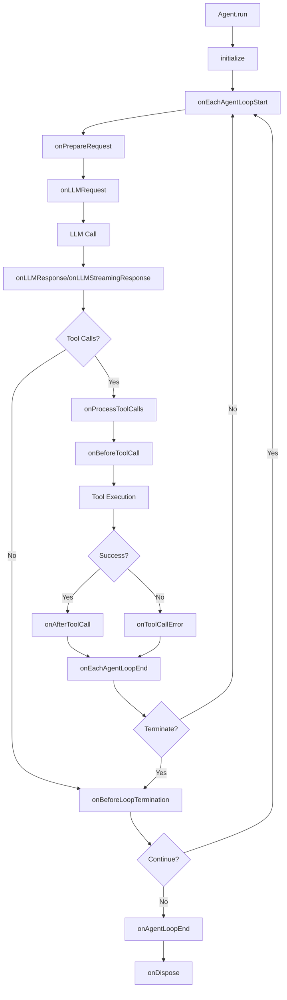

# Agent Hooks

Agent hooks provide a powerful way to extend and customize the behavior of your agents throughout their execution lifecycle. The `BaseAgent` class exposes a comprehensive set of hooks that allow you to intercept, modify, and react to various events during agent execution.

## Overview

| Hook | Description | Trigger |
|------|-------------|----------|
| [`initialize()`](#initialize) | Agent initialization setup | Once at startup |
| [`onPrepareRequest()`](#onpreparerequest) | Modify system prompt and tools | Before each LLM request |
| [`onLLMRequest()`](#onllmrequest) | Inspect outgoing LLM requests | Before each LLM call |
| [`onLLMResponse()`](#onllmresponse) | Process LLM responses | After each LLM call |
| [`onLLMStreamingResponse()`](#onllmstreamingresponse) | Handle streaming chunks | During streaming responses |
| [`onEachAgentLoopStart()`](#oneachagentloopstart) | Loop iteration start | Each iteration start |
| [`onBeforeToolCall()`](#onbeforetoolcall) | Validate/modify tool args | Before each tool execution |
| [`onAfterToolCall()`](#onaftertoolcall) | Process tool results | After each tool execution |
| [`onToolCallError()`](#ontooolcallerror) | Handle tool errors | When tools fail |
| [`onProcessToolCalls()`](#onprocesstoolcalls) | Override tool execution | Before tool batch processing |
| [`onEachAgentLoopEnd()`](#oneachagentloopend) | Loop iteration end | Each iteration end |
| [`onBeforeLoopTermination()`](#onbeforelooptermination) | Control termination | Before loop ends |
| [`onAgentLoopEnd()`](#onagentloopend) | Loop completion | When loop finishes |
| [`onDispose()`](#ondispose) | Resource cleanup | During disposal |



## `initialize()`

Called during agent initialization for setup operations.

```ts
class CustomAgent extends BaseAgent {
  async initialize(): Promise<void> {
    await this.connectToDatabase();
    await this.loadConfiguration();
    console.log('Agent initialized successfully');
  }
}
```

## `onPrepareRequest()`

Called before preparing LLM requests, allowing dynamic modification of system prompts and tools.

```ts
class CustomAgent extends BaseAgent {
  onPrepareRequest(context: PrepareRequestContext): PrepareRequestResult {
    let { systemPrompt, tools } = context;
    
    // Modify system prompt based on iteration
    if (context.iteration > 3) {
      systemPrompt += '\n\nNote: Focus on providing a concise final answer.';
    }
    
    // Filter tools based on current state
    const filteredTools = tools.filter(tool => {
      if (context.iteration > 5 && tool.name.includes('search')) {
        return false; // Disable expensive tools in later iterations
      }
      return true;
    });
    
    return { systemPrompt, tools: filteredTools };
  }
}
```

## `onLLMRequest()`

Triggered before sending requests to LLM, allowing inspection or logging.

```ts
class CustomAgent extends BaseAgent {
  async onLLMRequest(id: string, payload: LLMRequestHookPayload): Promise<void> {
    console.log(`Sending LLM request for session ${id}`);
    console.log(`Model: ${payload.model}`);
    console.log(`Message count: ${payload.messages.length}`);
    
    // Log token usage for monitoring
    this.logTokenUsage(payload);
  }
}
```

## `onLLMResponse()`

Triggered after receiving responses from LLM, allowing response processing.

```ts
class CustomAgent extends BaseAgent {
  async onLLMResponse(id: string, payload: LLMResponseHookPayload): Promise<void> {
    console.log(`Received response for session ${id}`);
    
    // Track response metrics
    this.trackResponseTime(payload.elapsedMs);
    this.trackTokenUsage(payload.usage);
    
    // Handle truncated responses
    if (payload.response.choices[0]?.finish_reason === 'length') {
      console.warn('Response was truncated due to length limit');
    }
  }
}
```

## `onLLMStreamingResponse()`

Triggered for streaming responses from LLM.

```ts
class CustomAgent extends BaseAgent {
  onLLMStreamingResponse(id: string, payload: LLMStreamingResponseHookPayload): void {
    // Process streaming chunk
    console.log(`Streaming chunk for session ${id}: ${payload.chunk}`);
    
    // Update UI or send real-time updates
    this.updateStreamingUI(payload.chunk);
  }
}
```

## `onEachAgentLoopStart()`

Called at the beginning of each agent loop iteration.

```ts
class CustomAgent extends BaseAgent {
  async onEachAgentLoopStart(sessionId: string): Promise<void> {
    console.log(`Starting iteration ${this.getCurrentLoopIteration()} for session ${sessionId}`);
    
    // Inject dynamic context
    this.updateContextForIteration();
    
    // Check resource limits
    if (this.getCurrentLoopIteration() > this.maxIterations * 0.8) {
      console.warn('Approaching maximum iteration limit');
    }
  }
}
```

## `onBeforeToolCall()`

Called before executing tools, allowing argument modification or validation.

```ts
class CustomAgent extends BaseAgent {
  async onBeforeToolCall(
    id: string,
    toolCall: { toolCallId: string; name: string },
    args: any
  ): Promise<any> {
    console.log(`Executing tool: ${toolCall.name}`);
    
    // Add validation
    if (toolCall.name === 'fileOperation' && !this.hasFilePermission()) {
      throw new Error('Insufficient permissions for file operations');
    }
    
    // Modify arguments
    if (toolCall.name === 'searchWeb') {
      args.maxResults = Math.min(args.maxResults || 10, 5);
    }
    
    return args;
  }
}
```

## `onAfterToolCall()`

Called after executing tools, allowing result modification or post-processing.

```ts
class CustomAgent extends BaseAgent {
  async onAfterToolCall(
    id: string,
    toolCall: { toolCallId: string; name: string },
    result: any
  ): Promise<any> {
    console.log(`Tool ${toolCall.name} execution completed`);
    
    // Post-process results
    if (toolCall.name === 'imageAnalysis') {
      result.confidence = this.calculateConfidence(result);
    }
    
    // Log tool usage
    this.logToolUsage(toolCall.name, result);
    
    return result;
  }
}
```

## `onToolCallError()`

Called when tool execution results in an error, allowing error handling or transformation.

```ts
class CustomAgent extends BaseAgent {
  async onToolCallError(
    id: string,
    toolCall: { toolCallId: string; name: string },
    error: any
  ): Promise<any> {
    console.error(`Tool ${toolCall.name} execution failed:`, error);
    
    // Provide fallback responses
    if (toolCall.name === 'weatherAPI') {
      return 'Weather information is currently unavailable, please try again later.';
    }
    
    // Transform error messages
    if (error.code === 'RATE_LIMIT') {
      return 'Service is temporarily busy, please wait a moment and try again.';
    }
    
    return `Error: ${error.message || error}`;
  }
}
```

## `onProcessToolCalls()`

Intercepts tool call processing, essential for testing and mocking.

```ts
class TestAgent extends BaseAgent {
  onProcessToolCalls(
    id: string,
    toolCalls: ChatCompletionMessageToolCall[]
  ): ToolCallResult[] | undefined {
    // Mock tool calls for testing
    if (this.isTestMode) {
      return toolCalls.map(call => ({
        toolCallId: call.id,
        content: this.getMockResult(call.function.name),
      }));
    }
    
    // Return undefined for normal execution
    return undefined;
  }
}
```

## `onEachAgentLoopEnd()`

Called at the end of each agent loop iteration.

```ts
class CustomAgent extends BaseAgent {
  async onEachAgentLoopEnd(context: EachAgentLoopEndContext): Promise<void> {
    console.log(`Completed iteration ${context.iteration} for session ${context.sessionId}`);
    
    // Log iteration metrics
    this.logIterationMetrics(context);
    
    // Check if should continue
    if (this.shouldTerminateEarly(context)) {
      this.requestLoopTermination();
    }
  }
}
```

## `onBeforeLoopTermination()`

Called before agent loop terminates, allowing control over termination conditions.

```ts
class CustomAgent extends BaseAgent {
  onBeforeLoopTermination(
    id: string,
    finalEvent: AgentEventStream.AssistantMessageEvent
  ): LoopTerminationCheckResult {
    // Ensure specific tools were called
    const requiredTools = ['validateResult', 'saveToDatabase'];
    const calledTools = this.getCalledToolsInSession(id);
    
    const allRequiredToolsCalled = requiredTools.every(tool => 
      calledTools.includes(tool)
    );
    
    if (!allRequiredToolsCalled) {
      console.log('Required tools not called, continuing loop');
      return { finished: false };
    }
    
    // Check response quality
    if (finalEvent.content.length < 50) {
      console.log('Response too short, requesting more details');
      return { finished: false };
    }
    
    return { finished: true };
  }
}
```

## `onAgentLoopEnd()`

Called when the entire agent loop completes.

```ts
class CustomAgent extends BaseAgent {
  async onAgentLoopEnd(id: string): Promise<void> {
    console.log(`Agent loop completed for session ${id}`);
    
    // Clean up session resources
    this.cleanupSession(id);
    
    // Send completion notification
    await this.notifyCompletion(id);
  }
}
```

## `onDispose()`

Called during agent disposal for resource cleanup.

```ts
class CustomAgent extends BaseAgent {
  protected async onDispose(): Promise<void> {
    // Clean up resources
    await this.closeConnections();
    this.clearTimers();
    console.log('Agent disposal completed');
  }
}
```
