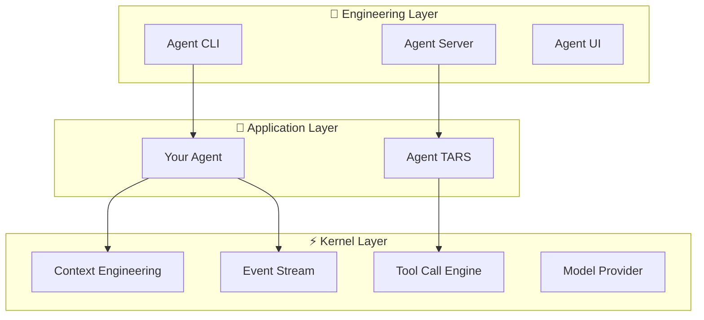

# Tarko

**Tool-augmented Agent Runtime Kernel, Open-source**

Tarko is a tool-call and event-stream driven Agent runtime framework with powerful **Context Engineering** capabilities, supporting multiple LLM providers and providing extensible **Agent Hooks**.

## ✨ Key Features

### 🧠 Context Engineering
Build agents capable of long-running operations with automatic context compression, intelligent windowing, and state persistence.

### 🔧 Tool Call Engine
Unified interface for tools across different LLM providers with custom parsers and streaming support.

### 🌊 Event Stream
Standardized communication protocol with native streaming and real-time updates.

### 🔌 Agent Hooks
Extensible hook system for customizing agent behavior at every stage of execution.

### 🏗️ Production Ready
Complete engineering solutions with CLI, Server, and UI components for development and deployment.

## 🚀 Quick Start

### Create Your First Agent

```bash
npm create tarko
```

Or start from a template:

```typescript
import { Agent, createTool } from '@tarko/agent';

const weatherTool = createTool({
  name: 'get_weather',
  description: 'Get current weather for a location',
  parameters: {
    type: 'object',
    properties: {
      location: { type: 'string' }
    },
    required: ['location']
  },
  handler: async ({ location }) => {
    // Your weather API integration
    return `Weather in ${location}: Sunny, 72°F`;
  }
});

const agent = new Agent({
  name: 'WeatherBot',
  systemPrompt: 'You are a helpful weather assistant.',
  tools: [weatherTool],
  modelProvider: {
    apiKey: process.env.OPENAI_API_KEY,
    model: 'gpt-4'
  }
});

export default agent;
```

### Run Your Agent

```bash
npx tarko run weather-bot.ts
```

This starts a local server with web UI at `http://localhost:3000`.

## 🏛️ Architecture

Tarko follows a clean three-layer architecture:



## 🌟 Who Uses Tarko?

Tarko powers several production systems:

- **[UI-TARS-2](https://seed-tars.com/showcase/ui-tars-2/)** - Advanced UI automation
- **[UI-TARS-desktop](https://github.com/bytedance/UI-TARS-desktop)** - Desktop automation
- **[Agent TARS](https://agent-tars.com/)** - General-purpose multimodal agent

## 📚 Learn More

<div style="display: grid; grid-template-columns: repeat(auto-fit, minmax(250px, 1fr)); gap: 1rem; margin: 2rem 0;">

**🚀 [Quick Start](/guide/quick-start)**  
Get up and running in minutes

**🏗️ [Architecture](/guide/architecture)**  
Understand Tarko's design

**🧠 [Context Engineering](/guide/context-engineering)**  
Master long-running agents

**🔧 [Tool Call Engine](/guide/tool-call-engine)**  
Build custom tools

**🌊 [Agent Protocol](/guide/agent-protocol)**  
Standardized communication

**🔌 [Agent Hooks](/guide/agent-hooks)**  
Extend agent behavior

</div>

## 💡 Examples

Explore practical examples:

- **[Getting Started Examples](/examples/getting-started)** - Basic agents and tools
- **[Custom Tools](/examples/custom-tools)** - Advanced tool development
- **[Server Integration](/examples/server-integration)** - Production deployment
- **[Custom Hooks](/examples/custom-hooks)** - Behavior customization

## 🤝 Community

Join the Tarko community:

- **GitHub**: [bytedance/UI-TARS-desktop](https://github.com/bytedance/UI-TARS-desktop)
- **Issues**: Report bugs and request features
- **Discussions**: Share ideas and get help

## 📄 License

Tarko is open source software licensed under the [Apache 2.0 License](https://github.com/bytedance/UI-TARS-desktop/blob/main/LICENSE).
