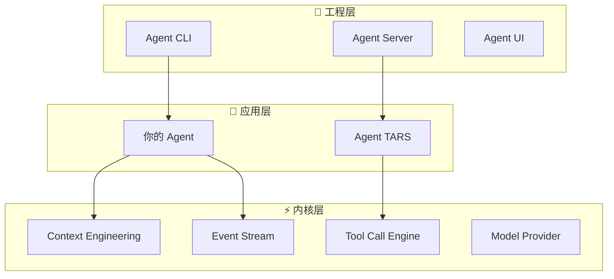

# Tarko

**工具增强的 Agent 运行时内核，开源**

Tarko 是一个以 "Tool Call" 和 "事件流" 驱动的 Agent 运行时框架，内置了强大的 **Context Engineering** 能力，支持多种 LLM Provider，并提供可扩展的 **Agent Hooks**。

## ✨ 核心特性

### 🧠 Context Engineering
构建支持长程运行的 Agent，具备自动上下文压缩、智能窗口管理和状态持久化能力。

### 🔧 Tool Call Engine
跨不同 LLM Provider 的统一工具接口，支持自定义解析器和流式处理。

### 🌊 Event Stream
标准化通信协议，支持原生流式传输和实时更新。

### 🔌 Agent Hooks
可扩展的钩子系统，在执行的每个阶段自定义 Agent 行为。

### 🏗️ 生产就绪
完整的工程解决方案，包含 CLI、Server 和 UI 组件，用于开发和部署。

## 🚀 快速开始

### 创建你的第一个 Agent

```bash
npm create tarko
```

或从模板开始：

```typescript
import { Agent, createTool } from '@tarko/agent';

const weatherTool = createTool({
  name: 'get_weather',
  description: '获取指定位置的当前天气',
  parameters: {
    type: 'object',
    properties: {
      location: { type: 'string' }
    },
    required: ['location']
  },
  handler: async ({ location }) => {
    // 你的天气 API 集成
    return `${location} 的天气：晴天，22°C`;
  }
});

const agent = new Agent({
  name: 'WeatherBot',
  systemPrompt: '你是一个有用的天气助手。',
  tools: [weatherTool],
  modelProvider: {
    apiKey: process.env.OPENAI_API_KEY,
    model: 'gpt-4'
  }
});

export default agent;
```

### 运行你的 Agent

```bash
npx tarko run weather-bot.ts
```

这将启动一个本地服务器，Web UI 地址为 `http://localhost:3000`。

## 🏛️ 架构

Tarko 遵循清晰的三层架构：



## 🌟 谁在使用 Tarko？

Tarko 驱动了多个生产系统：

- **[UI-TARS-2](https://seed-tars.com/showcase/ui-tars-2/)** - 先进的 UI 自动化
- **[UI-TARS-desktop](https://github.com/bytedance/UI-TARS-desktop)** - 桌面自动化
- **[Agent TARS](https://agent-tars.com/)** - 通用多模态 Agent

## 📚 了解更多

<div style="display: grid; grid-template-columns: repeat(auto-fit, minmax(250px, 1fr)); gap: 1rem; margin: 2rem 0;">

**🚀 [快速开始](/guide/quick-start)**  
几分钟内启动和运行

**🏗️ [架构设计](/guide/architecture)**  
了解 Tarko 的设计

**🧠 [Context Engineering](/guide/context-engineering)**  
掌握长程运行的 Agent

**🔧 [Tool Call Engine](/guide/tool-call-engine)**  
构建自定义工具

**🌊 [Agent Protocol](/guide/agent-protocol)**  
标准化通信

**🔌 [Agent Hooks](/guide/agent-hooks)**  
扩展 Agent 行为

</div>

## 💡 示例

探索实用示例：

- **[入门示例](/examples/getting-started)** - 基础 Agent 和工具
- **[自定义工具](/examples/custom-tools)** - 高级工具开发
- **[服务器集成](/examples/server-integration)** - 生产部署
- **[自定义 Hooks](/examples/custom-hooks)** - 行为定制

## 🤝 社区

加入 Tarko 社区：

- **GitHub**: [bytedance/UI-TARS-desktop](https://github.com/bytedance/UI-TARS-desktop)
- **Issues**: 报告 Bug 和请求功能
- **Discussions**: 分享想法和获得帮助

## 📄 许可证

Tarko 是基于 [Apache 2.0 许可证](https://github.com/bytedance/UI-TARS-desktop/blob/main/LICENSE) 的开源软件。
